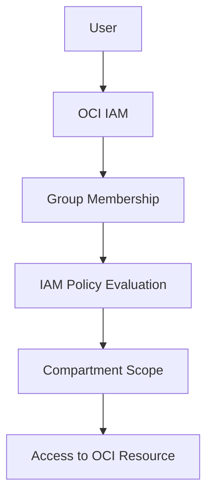
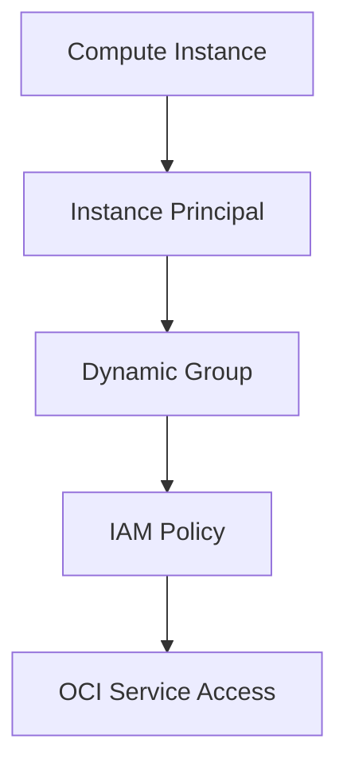

# OCI IAM Access Control Guide

## Overview


The repository explains how OCI IAM is used to control access through users, groups, compartments, policies, dynamic groups, and instance principals.
My focus was to explain how access is granted in OCI, how permissions are controlled through policies, and how resources can be protected using compartment-level access control.
This contribution demonstrates my understanding of how OCI IAM supports secure access control and governance across cloud resources. No client-confidential, proprietary, or project-specific information is included.

---

## Why I Created This

Access control is one of the most important areas in any cloud environment.
In OCI, users should not get direct or uncontrolled access to resources. Access should be granted through groups, policies, compartments, and service identity patterns such as dynamic groups and instance principals.
I created this repository to keep the IAM access flow simple and clear.

---

## Product Used

Oracle Cloud Infrastructure Identity and Access Management

---

## Simple IAM Access Flow



---

## Instance Principal Access Flow



---

## Components Covered

This repository covers the following OCI IAM components:

- Users
- Groups
- Compartments
- IAM Policies
- Dynamic Groups
- Instance Principals
- Resource Principals
- Basic access flow
- Least privilege access control

---

## Repository Structure

```text
architecture/
  iam-access-flow.md

docs/
  iam-overview.md
  users-and-groups.md
  compartments.md
  iam-policies.md
  dynamic-groups-and-instance-principals.md
  advanced-iam-access-patterns.md
  product-usage-summary.md

README.md
```

## What I Understood

The key point from this exercise is that OCI IAM should not be viewed only as users and passwords.

A proper access control model depends on how users, groups, policies, compartments, and service identities work together. Group membership decides who receives access, policies define what actions are allowed, and compartments define where that access applies.

For workloads such as compute instances, dynamic groups and instance principals help avoid storing API keys directly on servers.

This helped me understand IAM from an access control and governance perspective.

---

## Confidentiality Note

All examples in this repository are based on my own product usage and documentation. No client-confidential, proprietary, or project-specific information is included.
