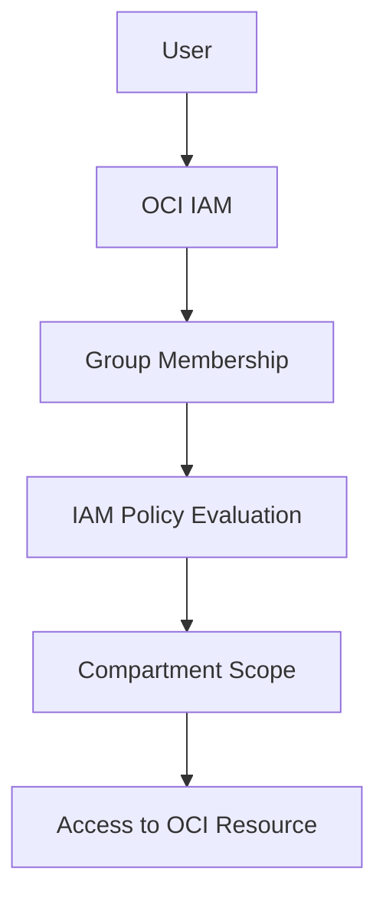
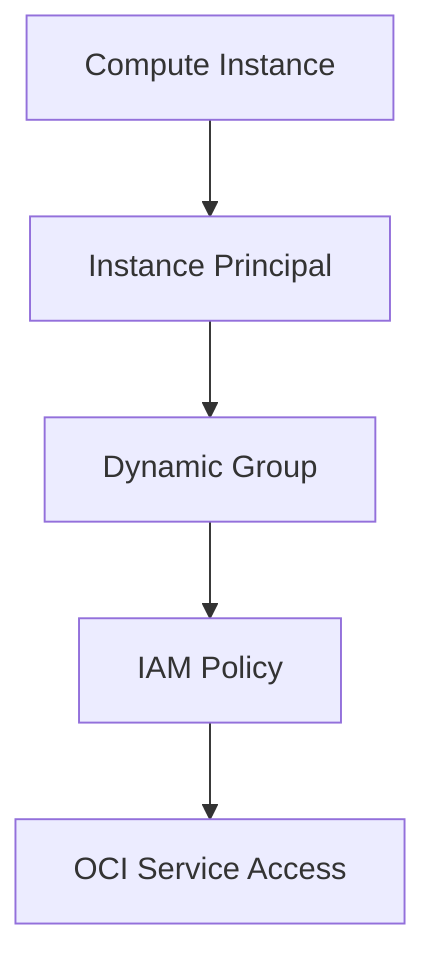

# OCI IAM Access Flow

This diagram shows a simple OCI IAM access flow.

The main point is that access is not granted directly to a user without control. In OCI, access is managed through group membership, IAM policies, and compartment scope.

---

## Instance Principal Flow

This flow shows how a compute instance can access OCI services without storing API keys on the server. The instance is included in a dynamic group, and IAM policies control what the dynamic group can access.
