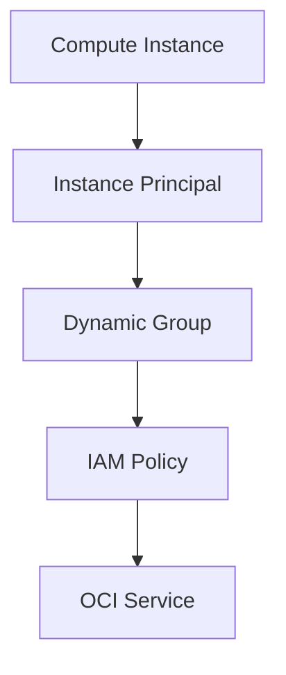

# Dynamic Groups and Instance Principals

Dynamic groups and instance principals are used when OCI resources need to access other OCI services.
This is useful because it avoids storing API keys directly on compute instances.

---

## Dynamic Groups

A dynamic group includes OCI resources based on matching rules.

For example, compute instances in a specific compartment can be included in a dynamic group.

Example rule:

ALL {instance.compartment.id = '<compartment_ocid>'}

---
## Instance Principals

Instance principals allow compute instances to authenticate to OCI services using the instance identity.

The instance does not need a user API key stored on the server.

---

## Access Flow

---

## Example Policy

Allow dynamic-group app-instances to read buckets in compartment Storage
This policy allows instances in the dynamic group to read Object Storage buckets in the Storage compartment.

---

## What I Understood

My main understanding is that dynamic groups and instance principals are useful for workload identity.
They help compute instances access OCI services securely without depending on manually stored credentials.
