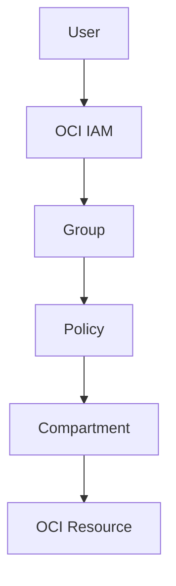

# IAM Overview

Identity and Access Management in Oracle Cloud Infrastructure is used to control who can access cloud resources and what actions they can perform.

OCI IAM supports two main areas:

- Authentication: confirming the identity of a user or service
- Authorization: deciding what actions that identity is allowed to perform

OCI IAM uses users, groups, policies, and compartments to manage access in a controlled way.

---

## Why IAM Is Important

IAM is important because cloud access should be controlled clearly.

A user, administrator, application, or compute instance should only get the access that is required for the work they need to perform.

This supports least privilege access and reduces the risk of giving unnecessary permissions.

---

## Basic IAM Flow

---

## What I Understood

My main understanding is that creating a user alone does not give proper access in OCI.
Access has to be controlled through groups, policies, and compartments. Groups define who gets access, policies define what they can do, and compartments define where the access applies.
